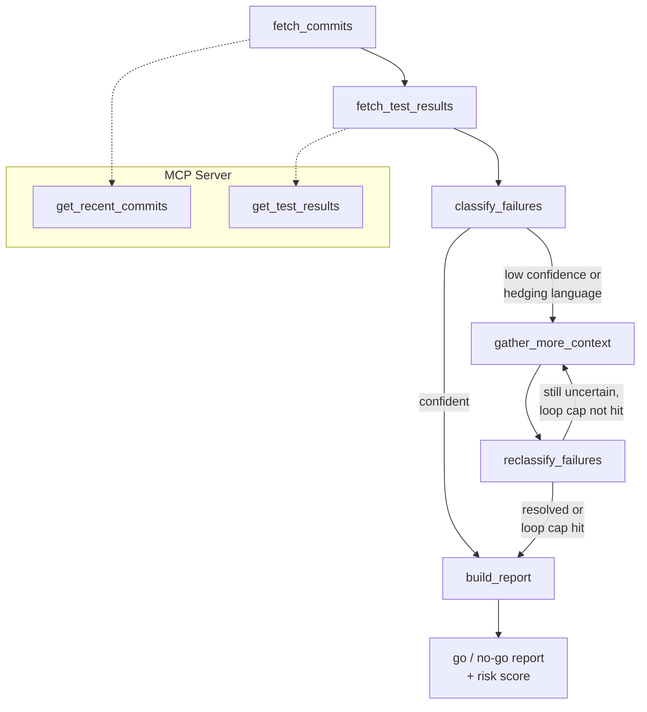

# Release-Readiness Copilot

An AI agent that investigates whether a build is safe to ship — it reads recent commits, checks test results, reasons about which failures are real regressions versus noise, and produces a structured go/no-go report with its reasoning attached.

## Why I built this

I spent ~4.5 years in QA, test automation, and full-stack engineering, and a good chunk of that time was spent doing the exact thing this project automates: staring at a red CI run, pulling up the diff, and asking "did we actually break this, or is it just flaky?" That judgment call is a real skill, and it's also the part of QA that's hardest to explain to someone who's never done it — it's not a checklist, it's pattern-matching across a diff, an error message, and a test's history.

This project is my attempt to teach that judgment to an agent, using two of the stacks I wanted hands-on experience with: [MCP](https://modelcontextprotocol.io/) for exposing the data sources as tools, and [LangGraph](https://www.langchain.com/langgraph) for the decision-making loop. It's built on seeded, synthetic data rather than a live CI system, on purpose — the point is the reasoning pipeline, not a GitHub integration.

## Architecture



**Nodes 1–2** pull data through the MCP server rather than hardcoded API calls — the agent consumes commits and test runs as MCP tools, which is the actual differentiator here versus "an app that calls an API."

**Node 3** classifies each failing test as `caused_by_change`, `flaky`, or `unrelated`, with a confidence score and a one-line reasoning citing the evidence it used.

**The loop-back** (the "agentic" part, not just a script that calls an LLM once) is a conditional edge: if a classification comes back at ≤75% confidence, or its own reasoning contains hedging language ("but," "however," "possibly" — a sign the model is arguing with itself even at high stated confidence), the graph routes back to pull one extra piece of context it didn't have the first time: the diffs of commits that landed *after* the failing one. That's what lets it catch "this test failed here, but the very next commit already fixes the bug it exposed" — something a single-pass, per-commit classifier structurally can't see. It's capped at one loop, so the behavior stays bounded and explainable.

**Node 4** turns the classifications into a report — deterministically, not with another LLM call. A confident regression (`caused_by_change` at ≥70%) is an automatic no-go. Anything that's still below 60% confidence even after the loop-back's one reconsideration doesn't get asserted as an answer — it's flagged `needs_human_review` instead, because forcing a label onto genuinely ambiguous evidence is worse than admitting the uncertainty.

## Setup

```
python3 -m venv venv
source venv/bin/activate
pip install -r requirements.txt
```

## Run it

```
python run.py --offline          # no API key needed, rule-based classifier
export ANTHROPIC_API_KEY=...
python run.py                    # Claude does the classification
```

Model defaults to `claude-sonnet-5`; override with `COPILOT_MODEL`. Each run saves a timestamped report to `reports/` in both `.json` (for tooling — a CI gate could read this directly) and `.md` (for humans).

You can also poke at the MCP server on its own:
```
python mcp_server/server.py
# or, interactively (requires Node.js):
npx @modelcontextprotocol/inspector python mcp_server/server.py
```

## Sample report

Run against the seeded data (5 commits, 5 test runs — a real regression, a flaky test, an infra failure, a clean fix, and a "failure exposed by one commit, fixed by the next" edge case):

```markdown
# Release-Readiness Report

**Recommendation:** 🛑 NO-GO
**Risk score:** 59/100
**Mode:** offline

> 2 likely regression(s) found: test_checkout.test_stacked_discounts_total, test_checkout.test_zero_discount_cart.

## Commits

### 🔴 `a1b2c3d` Refactor checkout total calculation to support discount stacking
- **Likely caused by this change** (80%) *(reconsidered after loop-back)* — `test_checkout.test_stacked_discounts_total`
  Passed 10/10 before; commit modifies files related to 'checkout'.

### 🔴 `i7j8k9l` Bump logging library version
- **Unrelated (infra / pre-existing)** (85%) *(reconsidered after loop-back)* — `test_orders.test_order_history_pagination`
  Commit m1n2o3p ('Fix off-by-one in pagination for order history') lands right after and
  fixes the 'orders' area this test covers - this was a pre-existing bug, not something
  this commit caused.
```

(Full reports include all 5 commits, per-failure reasoning, and a summary table — see `reports/` after running it yourself.)

## What's in here

| Path | What it does |
|---|---|
| `mcp_server/server.py` | MCP server exposing `get_recent_commits` and `get_test_results` |
| `data/` | Seeded synthetic commits + test runs |
| `graph/classifier.py` | First-pass and loop-back classification (Claude + an `--offline` heuristic stand-in) |
| `graph/nodes.py` | The graph's nodes, including the confidence/hedging check that triggers the loop-back |
| `graph/pipeline.py` | Wires the nodes into the LangGraph graph with the conditional loop-back edge |
| `graph/report.py` | Deterministic risk scoring + go/no-go/needs-review logic, JSON + markdown rendering |
| `run.py` | Entry point |

## Known limitations

- **Classification isn't perfectly stable run-to-run.** On the seeded data, the payment-gateway flaky test has landed on different labels (and different confidence) across separate runs of the exact same input — each time with a defensible explanation, since the test really is ambiguous by design (a real intermittent flake sitting near a change that plausibly affects timing). The loop-back and the human-review tier are the mitigations for this, not a claim that the classifier is deterministic. Worth naming, not hiding.
- **No live CI/GitHub integration.** Seeded data was a deliberate scope cut so the reasoning pipeline — the actual differentiator — got the time instead of infra plumbing.
- **Not built:** an optional PyTorch pre-classifier to pre-score flaky-likelihood before the LLM reasons over it (cut per the original plan — nice-to-have, not the core story).
